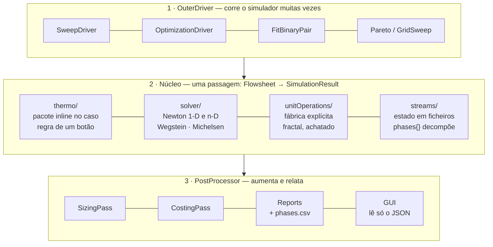

# Mapa de consolidação — onde está cada peça

> **O que este ficheiro é.** Uma VISTA sobre a arquitetura já decidida noutros
> documentos, com uma marca de estado por bloco.  Não é uma autoridade: cada
> linha aponta para o documento que decide.  Não carrega contagens — essas são
> geradas (`generated/releaseInventory.json`), e um número com duas casas é o
> pecado da aridade.  Mapa de autoridades: [`README.md`](README.md).

Um bloco só conta como **consolidado** quando as três coisas existem:

1. o contrato está **escrito** num documento;
2. o motor **recusa** quem o viola, por nome e com remédio;
3. existe um **caso que dispara essa recusa** — não um caso que descreve a
   estrutura, um caso que a exercita.

A terceira é a que costuma faltar, e é a que apanha a reversão silenciosa: um
teste de estrutura sobrevive à correção ser desfeita.

---

## As três camadas

O `main.cpp` é um orquestrador fino.  O simulador é uma **função pura**
(`runSimulation`) — o caminho directo e todos os *outer drivers* chamam o
mesmo.

---

## Estado por contrato

| Contrato | Escrito em | Recusa | Caso que a dispara | Estado |
|---|---|---|---|---|
| Estado das correntes (`0/`, `converged/`, papéis pela topologia) | [`stream-state-architecture.md`](stream-state-architecture.md) | leitor + `choupo-init0` | completude, `streams{}` refusado | assente |
| Decomposição por fases (aquosa · orgânica · sólida, especiação na fase, PSD na população) | CLAUDE.md §6 | `StreamStateIO` reader | `check_phase_speciation` (a–i) | assente |
| Plano sequencial (cortes + ordem) | CLAUDE.md §6 | `validateSequentialPlan` | seis recusas nomeadas | assente |
| Um só datum de entalpia | [`../ai/energy.md`](../ai/energy.md) | `reactionHeat()` partilhado | estacionário e batch | assente |
| Sal ion-derivado, nunca bloco de componente | [`electrolyte-data-architecture.md`](electrolyte-data-architecture.md) | `check_ion_pins` | sai 1 se as duas casas existirem | assente |
| Árvore de eletrólitos, cinco casas | [`electrolyte-data-architecture.md`](electrolyte-data-architecture.md) | loader + gates de identidade | tipos, `aq`, ontologia | assente |
| Fronteira de modelo (H conservado, T lido) | [`../ai/energy.md`](../ai/energy.md) | auditoria opcional, recusa em mudança de fase | `thermoFor` | assente |
| Identidade de par de equilíbrio (D2) | [`../design/equilibrium-parameterisation-identity.md`](../design/equilibrium-parameterisation-identity.md) | `check_legacy_schema` | corpus migrado | assente |
| **Identidade de registo** (dois ficheiros, uma chave) | este mapa + `data-doctrine.md` §1 | `records::ScanGuard` | `check_registry_scan` | **2026-07-30** |
| **Cobertura de tipos** (uma classe, um caso) | este mapa | — (é coberta, não recusa) | `check_type_coverage` | **2026-07-30** |
| **Contrato do headline** (aponta para dentro dos diagnósticos) | — | `choupoProps` recusa | qualquer caso da op | **2026-07-30** |
| **Química declarada pelo caso** (nenhuma unidade a escolhe) | CLAUDE.md §5/§6 | `Flowsheet` recusa a chave ao nível da unidade | `check_no_unit_chemistry` (4) | **2026-07-31** |
| **Identidade de espécie** (uma casa, coerência verificada) | CLAUDE.md §5 | `SpeciationSolver` recusa `z` incoerente | `check_species_identity` (2 recusas) | **2026-07-31** |
| **ThermoResolver** (declaração persistida verificada) | CLAUDE.md §5 | 3 recusas no `ThermoPackageBuilder` | `check_resolver_coherence` (3) | **2026-07-31** |
| **Ponte aquosa** (componente → espécie, só declarada) | CLAUDE.md §5 (F2) | `AqueousBridge::singleMaster` | `check_typed_identifiers` (membrane08) | **2026-07-31** |
| **As duas bases em TODA a corrente** (onde o pacote resolve iões, incluindo a entrada) | CLAUDE.md §5 | leitor verifica `m = A n` contra as pontes declaradas | `check_both_bases` (2 recusas + negativo **verificado por sabotagem**) | **2026-07-31** |
| **Identidade reduzida** (um componente cunhado recebe os factos que declara) | CLAUDE.md §5 | — (é perda de dado, não recusa) | `check_both_bases` (veredicto do balanço) | **2026-07-31** |
| **Marcador `.cho`** (o que define um caso, não só o que a busca usa) | CLAUDE.md §3 | `check_sealed_corpus` sai 1 | um caso sem marcador é nomeado | **2026-07-31** |
| Chaves não lidas (`murphreeEficiency` corre em silêncio) | [`../design/unread-dict-keys-proposal.md`](../design/unread-dict-keys-proposal.md) | — | — | **espera decisão** |
| Vocabulário do `role` | `data/tmp/_ROLE_VOCABULARY_GAP.md` | — | — | **espera decisão** |
| Termo de transferência (D3) | [`../design/standard-state-transfer-adr.md`](../design/standard-state-transfer-adr.md) | contrato só | — | por implementar |

---

## O padrão, agora com quatro instâncias

Quatro contratos desta semana tinham **a regra escrita e a recusa no motor**,
sem nada a ligá-las.  A forma repete-se:

> *Um gate que lê o corpus prova o corpus, nunca o motor.*

E repete-se por uma razão específica: **um corpus coerente nunca toma o
caminho da recusa**.  Quanto melhor curada está a árvore, menos exercitada
fica a defesa que a protege — até que um aluno com um ficheiro fora da árvore
seja a primeira pessoa a descobrir se ela ainda funciona.

Um corolário, que custou uma leitura errada antes de ficar claro: **uma
mutação que não alcança o caminho do código não prova nada, em nenhuma
direcção.**  Remover a ponte aquosa do `membrane01` não muda um único KPI —
um módulo de solução-difusão preça o SAL, nunca os iões — e lido à letra isso
diria «o motor não recusa».  A mesma remoção no `membrane08`, cujo caminho de
incrustação atravessa a ponte, é recusada pelo nome.

## Como ler a coluna «caso que a dispara»

O `check_phase_speciation` tem nove casos e **três deles passam com a correção
desfeita** — testam estrutura, não verificação.  Isso está escrito no cabeçalho
do próprio gate, e é a razão pela qual esta tabela distingue as duas coisas.  Um
contrato cuja única prova é estrutural ainda não está consolidado; está
descrito.

Dois exemplos do mesmo dia, para calibrar:

* o leitor recusava um bloco de especiação numa corrente parcialmente vapor, e o
  gate provava-o — **sobre um ficheiro escrito à mão**.  O ESCRITOR produzia
  exactamente esse ficheiro, e ninguém notou até a volta completa
  (escrever → ler) ser testada;
* a caixa de propriedades da GUI mostrava a semente do `0/` em vez da resposta,
  ao lado de um nó que mostrava a resposta.  Nenhum teste falhava porque nenhum
  teste perguntava de onde vinha o número.

## A quinta instância, e a que muda o método

As quatro acima foram encontradas a atacar a defesa.  A quinta — **as duas
bases em toda a corrente** — foi encontrada a fazer uma pergunta ao corpus
INTEIRO: *«percorre cada caso e confirma se as correntes têm todas, no fim, a
estrutura da arquitectura que consolidámos; até a entrada tem de ter a
especiação.»*  Não havia falha a investigar.  A auditoria respondeu com **24
casos que resolvem iões e 23 com lacuna**, em duas famílias com causas
opostas:

* os `flash*` reactivos: só a corrente de vapor sem bloco — **correcto**, uma
  corrente toda em vapor não tem fase aquosa para decompor;
* todos os cristalizadores e evaporadores Pitzer/eNRTL: **nem um ião, em
  corrente nenhuma**, entrada incluída.

A causa não era a física.  A passagem pós-solução estava escrita dentro de
`if (thermo.hasReactiveEquilibrium())`, e um pacote de molalidade **resolve
iões sem ter rede de equilíbrio** — caiu inteiro fora da guarda.  Por baixo,
mais duas: o sal chegava ao runtime como componente-identidade reduzido (nome,
MW, papel), de modo que o `dissociatesTo` declarado no seu próprio registo era
invisível ao motor que acabara de o ler; e o LEITOR recusava qualquer bloco de
especiação num caso sem química reactiva — ou seja, o motor teria escrito um
ficheiro que ele próprio recusava.

A lição de método, que vale mais do que a correcção: **atacar a defesa
encontra a defesa que não dispara; perguntar ao corpus encontra a regra que
nunca foi aplicada a metade dele.**  São dois exames diferentes, e o segundo
não estava a ser feito.

### A regra da identidade reduzida (dois erros, um campo de distancia)

O `Component::identity()` cunha o sal com nome + MW + papel, e o construtor de
eletrolitos usava-o e ficava por ali -- portanto **todo o facto que o registo
declara alem desses tres estava silenciosamente ausente em execucao**.  Dois
estavam, e os dois apareceram na mesma forma: o motor a dizer que falta um dado
que o seu proprio ficheiro de entrada declara.

* `dissociatesTo` -> nem um iao em corrente nenhuma de salmoura;
* `formula` -> o balanco de elementos a publicar
  `refusedSpecies.NaCl,"no molecular formula declared"` sobre um registo que diz
  `formula NaCl;` **tres linhas acima do MW que a mesma chamada acabara de ler**.

O balanco nunca esteve errado: dizia com fidelidade o que o runtime conseguia
ver.  A regra que fica: **um componente cunhado por `identity()` tem de receber
todos os factos declarados que lhe vao ser pedidos**, pelo registo de onde foi
cunhado -- uma leitura por facto, dois chamadores cada, nunca uma segunda copia
da analise sintactica.  Ao acrescentar um campo que o runtime le de um
Component, perguntar se o sal do pacote de eletrolitos lhe chega.

Um componente que genuinamente NAO tem o facto -- um corte de petroleo sem
formula molecular, o dowthermA, o poliestireno -- mantem a sua recusa honesta.
A regra e sobre factos DECLARADOS que se perdem, nunca sobre inventar um.

### O metodo tambem produz falsos positivos

Duas auditorias desta ronda acusaram lacunas que nao existiam, e as duas pela
mesma razao: **adivinhei a forma do artefacto em vez de a ler**.

* o balanco de elementos "faltava" no `ChemicalPlantTutorial` -- que usa a
  disposicao `reportsLayout postProcessing;`, uma opcao documentada, e o
  emite em `postProcessing/elementBalance/0/`;
* os 27 UNAVAILABLE "nao tinham razao nomeada" -- procurei uma chave `reason,`
  e o motor escreve `refusedSpecies.<nome>,<explicacao>`, uma linha por
  especie recusada, que e MAIS especifica e nao menos.

Nos dois casos o corpus estava certo e o palpite errado.  A diferenca face ao
achado da especiacao e simples e vale como regra: ali foram lidos ficheiros
`converged/` a serio.  **Perguntar ao corpus so vale se a pergunta for feita ao
artefacto, nao a ideia que se tem dele.**

### A testemunha negativa tem de poder falhar

A primeira versão da passagem guardava-se nos COMPONENTES: «algum componente
declara ponte?».  Sob essa guarda, **51 casos moleculares deste corpus** —
todos os reactores de ácido acético, as duas fábricas de amoníaco, o absorvedor
de CO2, a família inteira das membranas — ganhavam uma decomposição iónica
inventada, porque o registo do NaCl (ou do aceticAcid) declara a ponte mesmo
quando o mundo em vigor a trata como soluto agregado.  A regra é do **MODELO**,
não da substância: `hasElectrolyte()` pergunta se o modelo de actividade
trabalha em molalidade com cargas.

E o negativo do gate era `flash01` (benzeno/tolueno) — que **também** não ganha
bloco, e portanto teria passado durante todo esse erro.  Trocado por
`evaporator01_brine`: NaCl dentro de um pacote `gammaPhi`/ideal, exactamente a
forma que se estragou.  **Uma testemunha negativa que não pode falhar não é uma
testemunha.**

O mesmo aconteceu uma linha adiante: a recusa «nomes que não respondem a nada»
foi enxertada primeiro numa corrente com 30 % de vapor, e disparou a recusa
*da fracção de vapor* — também correcta, também não a que estava em teste.  Um
gate que lê só o código de saída teria marcado isso como passagem.  As duas
recusas verificam agora a MENSAGEM, não o código.

---

*Vista gerada a partir do repositório.  Para as contagens, ler
`generated/releaseInventory.json` ou correr `bin/curate/release_inventory.py`.*
