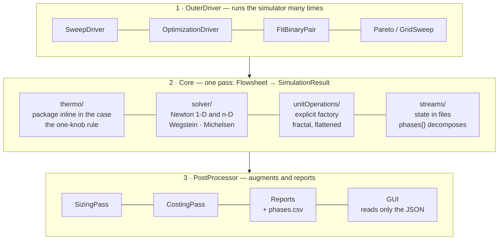

# Consolidation map — where each piece stands

> **What this file is.**  A VIEW over the architecture already decided in other
> documents, with one status mark per block.  It is not an authority: every row
> points at the document that decides.  It carries no counts — those are
> generated (`generated/releaseInventory.json`), and a number with two homes is
> the arity sin.  Authority map: [`README.md`](README.md).

A block counts as **consolidated** only when all three exist:

1. the contract is **written** in a document;
2. the engine **refuses** violators, by name and with a remedy;
3. there is a **case that FIRES that refusal** — not a case that describes the
   structure, a case that exercises it.

The third is the one that usually goes missing, and it is the one that catches
silent reversion: a structure test survives the fix being undone.

---

## The three layers

`main.cpp` is a thin orchestrator.  The simulator is a **pure function**
(`runSimulation`) — the direct path and every outer driver call the same one.

---

## Status per contract

| Contract | Written in | Refusal | Case that fires it | Status |
|---|---|---|---|---|
| Stream state (`0/`, `converged/`, roles from topology) | [`stream-state-architecture.md`](stream-state-architecture.md) | reader + `choupo-init0` | completeness, `streams{}` refused | settled |
| Phase decomposition (aqueous · organic · solid, speciation on the phase, PSD on the population) | CLAUDE.md §6 | `StreamStateIO` reader | `check_phase_speciation` (a-i) | settled |
| Sequential plan (tears + order) | CLAUDE.md §6 | `validateSequentialPlan` | six named refusals | settled |
| One enthalpy datum | [`../ai/energy.md`](../ai/energy.md) | shared `reactionHeat()` | steady and batch | settled |
| Ion-derived salt, never a component block | [`electrolyte-data-architecture.md`](electrolyte-data-architecture.md) | `check_ion_pins` | exits 1 if both homes exist | settled |
| Electrolyte tree, five homes | [`electrolyte-data-architecture.md`](electrolyte-data-architecture.md) | loader + identity gates | types, `aq`, ontology | settled |
| Model boundary (H conserved, T a readout) | [`../ai/energy.md`](../ai/energy.md) | optional audit, refusal on a phase change | `thermoFor` | settled |
| Equilibrium-pair identity (D2) | [`../design/equilibrium-parameterisation-identity.md`](../design/equilibrium-parameterisation-identity.md) | `check_legacy_schema` | migrated corpus | settled |
| **Record identity** (two files, one key) | this map + `data-doctrine.md` §1 | `records::ScanGuard` | `check_registry_scan` | **2026-07-30** |
| **Type coverage** (one class, one case) | this map | — (it is coverage, not a refusal) | `check_type_coverage` | **2026-07-30** |
| **Headline contract** (points into the diagnostics) | — | `choupoProps` refuses | any case of the op | **2026-07-30** |
| **Chemistry declared by the case** (no unit chooses it) | CLAUDE.md §5/§6 | `Flowsheet` refuses the key at unit level | `check_no_unit_chemistry` (4) | **2026-07-31** |
| **Species identity** (one home, coherence verified) | CLAUDE.md §5 | `SpeciationSolver` refuses an incoherent `z` | `check_species_identity` (2 refusals) | **2026-07-31** |
| **ThermoResolver** (persisted declaration verified) | CLAUDE.md §5 | 3 refusals in `ThermoPackageBuilder` | `check_resolver_coherence` (3) | **2026-07-31** |
| **Aqueous bridge** (component -> species, declared only) | CLAUDE.md §5 (F2) | `AqueousBridge::singleMaster` | `check_typed_identifiers` (membrane08) | **2026-07-31** |
| **Both bases on EVERY stream** (where the package resolves ions, the inlet included) | CLAUDE.md §5 | the reader verifies `m = A n` against the declared bridges | `check_both_bases` (2 refusals + a negative **sabotage-verified**) | **2026-07-31** |
| **Reduced identity** (a minted component gets the facts it declares) | CLAUDE.md §5 | — (it is data loss, not a refusal) | `check_both_bases` (the balance verdict) | **2026-07-31** |
| **The `.cho` marker** (what defines a case, not just what the search uses) | CLAUDE.md §3 | `check_sealed_corpus` exits 1 | a case with no marker is named | **2026-07-31** |
| **Dynamic initial state in `0/`** (no inline `initial{}` / `inlet{}`) | [`../../DYNAMIC_0_MIGRATION_HANDOFF.md`](../../DYNAMIC_0_MIGRATION_HANDOFF.md) | `choupoCtrl` + `choupoBatch` refuse the inline block by name | 42 dynamic cases seed from `0/` | **2026-07-16** |
| **Effective stage K** (incipient, defined without vapour) | CLAUDE.md §6 | `stageK` projects onto the simplex and announces | `check_stage_identity`, `check_tray_chemistry` | **2026-08-03** |
| **Version stamp = the LINE** (`Choupo-dev` on main) | `bin/curate/banner_version.py` header | `banner-version-gate` fails by name | one banner restored to `Choupo-2607` | **2026-08-04** |
| **A model is reachable or it is not a capability** (`edwardsPitzer`) | CLAUDE.md §5 | the props package refuses an unknown declared model from ONE name table | `check_edwards_model` (5 sabotages) | **2026-08-04** |
| **Sealing must not change the physics** | CLAUDE.md §5 | `choupo-import` compares the staged sealed run against the case's own golden | the closure disabled -> 12 named row differences, nothing installed | **2026-08-04** |
| **Subsystem layering** (no upward edge; acyclic but for one accepted cycle) | [`module-boundaries.md`](module-boundaries.md) §1 | `check_layering` (a compile-time fact, so a gate rather than an engine refusal) | 4 sabotages: upward edge · runtime reads a tool · stale accepted cycle · unplaced subsystem | **2026-08-05** |
| **A finding record is neutral data** (engine produces, result carries) | [`../design/where-a-finding-record-lives.md`](../design/where-a-finding-record-lives.md) | `check_layering` (D7's edge cannot return) | `core/ResultRecords.H`; the audit sits with the engine | **2026-08-05** |
| **Unread keys** (a misspelt key ran silently) | [`../design/unread-dict-keys-proposal.md`](../design/unread-dict-keys-proposal.md) | `core/DictAudit` reports the key BY NAME with what the model looked for | `check_unread_keys` | **2026-08-06 (row corrected)** |
| **Reference rung** (a formation datum is read on the rung it declares) | [`../design/reference-rung-refusal.md`](../design/reference-rung-refusal.md) | `h_pure_ig`/`s_pure_ig` refuse a non-gas `referenceState`, before the Cp check | `check_reference_rung` (probe-built record; the catalogue must never carry one) | **2026-08-06** |
| **Vapour-pressure validity window** (a declared `Trange` has a consumer) | CLAUDE.md §6 | ANNOUNCES, per I4 — two sentences branched on Tc, since above Tc no saturation curve exists to extrapolate | `check_psat_range` (both branches + the silent negative) | **2026-08-06** |
| **logK cross-check** (chemistry vs species, the two halves compared) | the gate's own header | — (it is COVERAGE, not a refusal) | `check_logk_crosscheck`: 2 of 77 derivable and both agree; 43 structurally uncheckable, 5 curable, named | **2026-08-06** |
| **Gas vs vapour** (`noncondensable` is the case's modelling class, Tc is the substance's physics) | [`../design/vapour-or-gas-is-a-state.md`](../design/vapour-or-gas-is-a-state.md) | `ReactiveVLE::solve` announces below the declared Tc | — **NO CASE FIRES IT**: all six cases using the flag run above Tc | **implemented, NOT witnessed** |
| **Multi-rung grammar** (a record may declare a SECOND standard state; a duplicate of its own is two homes) | [`../design/reference-rung-refusal.md`](../design/reference-rung-refusal.md) | `Component::readFromDict` refuses a sub-block naming the rung `referenceState` already names | `check_reference_rung` (probe: second rung accepted, duplicate refused) | **2026-08-07** |
| **The POTENTIAL is the interface, not the enthalpy** (`h_formation`/`s_formation`/`g_formation`; `h_pure_ig` delegates) | [`../design/reference-rung-refusal.md`](../design/reference-rung-refusal.md) | the rung guard sits AHEAD of the Cp guard on every ideal-gas surface | `check_reference_rung` (water gas→liquid: both legs visibly off CODATA in OPPOSITE directions, `g` closes far tighter than either) | **2026-08-07** |
| **Ice is a PHASE of the solvent, not a special case** (`SolidPhase::fEffective`; freezing-point depression falls out of K = 1) | [`../design/ice-as-a-solid-phase-of-the-solvent.md`](../design/ice-as-a-solid-phase-of-the-solvent.md) | five named refusals, each carrying its remedy | `check_ice_freezing` (**4 sabotages**; the crossing, the slope's sign AND magnitude, and the purity claim no balance check could catch) — **NO CASE FIRES IT**: the witness tutorial waits for a published anchor | **witnessed 2026-08-08 — `fpd01_nacl_freezing` consumes SolidPhase through the `freezingPoint` op (AAD 0.05 % at the interim anchor); the FLASH solid path stays absent — its target ruled below** |
| **ONE solid-equilibrium architecture** (any solid = a candidate under n = 0 ∧ lnSI ≤ 0 XOR n > 0 ∧ lnSI = 0; multiple explicit solid models behind one closure; ONE transfer mechanism) | [`../design/solid-equilibrium-spike.md`](../design/solid-equilibrium-spike.md) §7 (REVIEWED AND PASSED 2026-08-08; four boundary rulings) | the spike solver throws on non-convergence and on a candidate whose closures are mutually inconsistent | `check_solid_equilibrium_spike` (D1–D5 + purity, sabotage-verified; D5 measures the banned two-route shape at −30 % ledger violation) | **RATIFIED 2026-08-08 — migration AUTHORISED, not yet built** (production service, flash integration, SpeciationSolver as client are the authorised campaign) |
| **K_f derived** (promoted by the condition its own header set: a cited `Hfus` and a consumer) | CLAUDE.md §6 | — (it is a derivation, not a refusal); the declared 1.853 becomes the anchor against 1.8603 | `check_ice_freezing`, incl. **both** negatives, synthesised because no catalogue record has either shape | **2026-08-07** |
| `role` vocabulary | [`../design/role-vocabulary-forum-2026-08-02.md`](../design/role-vocabulary-forum-2026-08-02.md) | the classifier refuses an undeclared fact | corpus migrated | decided + built 2026-08-02 (panel option C; this row was STALE — [`queue-ruling-2026-08-08.md`](../design/queue-ruling-2026-08-08.md) D4) |
| Transfer term (D3) | [`../design/standard-state-transfer-adr.md`](../design/standard-state-transfer-adr.md) | contract only | — | DEFERRED by ruling 2026-08-08 (queue ruling N1) — reopens when a mixed-solvent case needs the rigor; not awaiting anyone |

---

## The pattern, now with four instances

Four contracts from one week had **the rule written and the refusal in the
engine**, with nothing tying them together.  The shape repeats:

> *A gate that reads the corpus proves the corpus, never the engine.*

And it repeats for a specific reason: **a coherent corpus never takes the
refusal path**.  The better curated the tree, the less exercised the defence
that protects it — until a student with a file from outside the tree is the
first person to find out whether it still works.

One corollary, which cost a misreading before it was clear: **a mutation that
does not reach the code path proves nothing, in either direction.**  Removing
the aqueous bridge from `membrane01` does not move a single KPI — a
solution-diffusion module prices the SALT, never the ions — and read literally
that would say "the engine does not refuse".  The same removal in `membrane08`,
whose fouling path crosses the bridge, is refused by name.

## A status guard armed on one of two routes guards neither (2026-08-07)

A variant of the same shape, found by promoting `K_f` from reference-only to
derived.

`K_f` was a parsed field with no consumer, and the project does not tolerate
those silently: the status was **written down** and made enforceable.
`check_ebullioscopic` failed the day anything called `K_f()`, so the note would
have to be rewritten rather than quietly outlived.  That is the right instinct,
and it still did not work.

**Nothing ever called `K_f()`.**  The consumer that arrived — `SolidPhase`'s
pure-crystal fugacity — reads the *inputs*, `subHfus()` and `subTripleT()`.  The
promotion walked straight past the trip-wire, and the gate went on printing

> *"K_f is REFERENCE-ONLY and verified unconsumed: it cannot be derived (no
> record declares a heat of fusion)"*

while a record declared one, the engine derived from it, and a phase consumed
it.  Four clauses, all false, exit 0.  This is the `check_true_ions` pathology —
a permanently-green gate — reached by a different road: not by losing its
inputs, but by watching **one of the two doors into the room**.

The remedy is not a second trip-wire on the other accessor; that only moves the
question to the third door.  It is to put the check where the *coverage* is:
`K_f`'s derivation, anchor and negatives now live in `check_ice_freezing`,
beside the phase that consumes them, and what stays behind is a **handover**
arm — the owning gate must exist and be in the suite.  Two things had to be
sabotage-hardened before that arm meant anything: it first matched the owning
gate's name in a *comment* rather than its invocation, and a companion arm that
tried to police the prose notes failed three different ways (a single search
missed the stale note; an every-occurrence search fired on the *corrected* ones,
which recount the old status to explain the promotion; a proximity search
survived a sabotage by reading the neighbouring `K_b` paragraph).

**Prose staleness is therefore not gated, and the gate says so.**  A text search
cannot tell a live claim from a recorded one, and a fourth tuning of a window
size would have been a coverage claim rather than coverage.

## How to read the "case that fires it" column

`check_phase_speciation` has nine cases and **three of them pass with the fix
reverted** — they test structure, not verification.  That is written in the
gate's own header, and it is why this table distinguishes the two.  A contract
whose only proof is structural is not consolidated yet; it is described.

Two examples from the same day, to calibrate:

* the reader refused a speciation block on a partially-vapour stream, and the
  gate proved it — **on a hand-written file**.  The WRITER produced exactly that
  file, and nobody noticed until the full round trip (write -> read) was tested;
* the GUI's property box showed the `0/` seed instead of the answer, beside a
  node showing the answer.  No test failed because no test asked where the
  number came from.

## The fifth instance, and the one that changes the method

The four above were found by attacking the defence.  The fifth — **both bases on
every stream** — was found by asking a question of the WHOLE corpus: *"walk
every case and confirm that the streams all end up with the structure of the
architecture we consolidated; even the inlet must carry the speciation."*  There
was no failure to investigate.  The audit answered with **24 cases that resolve
ions and 23 with a gap**, in two families with opposite causes:

* the reactive `flash*` cases: only the vapour stream lacked a block —
  **correct**, an all-vapour stream has no aqueous phase to decompose;
* every Pitzer/eNRTL crystalliser and evaporator: **not one ion, on any
  stream**, the inlet included.

The cause was not the physics.  The post-solve pass was written inside
`if (thermo.hasReactiveEquilibrium())`, and a molality package **resolves ions
without carrying an equilibrium network** — it fell entirely outside the guard.
Underneath, two more: the salt reached the runtime as a reduced identity
component (name, MW, role), so the `dissociatesTo` declared in its own record
was invisible to the engine that had just read it; and the READER refused any
speciation block in a case with no reactive chemistry — meaning the engine would
have written a file it refused itself.

The lesson about method, worth more than the fix: **attacking the defence finds
the defence that does not fire; asking the corpus finds the rule that was never
applied to half of it.**  Those are two different examinations, and the second
was not being done.

### The reduced-identity rule (two bugs, one field apart)

`Component::identity()` mints the salt with name + MW + role, and the
electrolyte builder used it and stopped there — so **every fact the record
declares beyond those three was silently absent at run time**.  Two were, and
both surfaced in the same form: the engine reporting a datum missing that its
own input file declares.

* `dissociatesTo` -> not one ion on any brine stream;
* `formula` -> the element balance publishing
  `refusedSpecies.NaCl,"no molecular formula declared"` about a record that says
  `formula NaCl;` **three lines above the MW the same call had just read**.

The balance was never wrong: it faithfully reported what the runtime could see.
The rule that stands: **a component minted by `identity()` must be handed every
declared fact it will be asked for**, through the record it was minted FROM —
one parse per fact, two callers each, never a second copy of the parse.  When
adding a field the runtime reads off a Component, ask whether the electrolyte
package's salt can reach it.

A component that genuinely does NOT have the fact — a petroleum cut with no
molecular formula, dowthermA, polystyrene — keeps its honest refusal.  The rule
is about DECLARED facts being dropped, never about inventing one.

### The method also produces false positives

Two audits in that round reported gaps that did not exist, and both for the same
reason: **I guessed the artifact's shape instead of reading it**.

* the element balance was "missing" from `ChemicalPlantTutorial` — which uses
  the `reportsLayout postProcessing;` arrangement, a documented option, and
  emits it in `postProcessing/elementBalance/0/`;
* the 27 UNAVAILABLE entries "had no named reason" — I searched for a `reason,`
  key, and the engine writes `refusedSpecies.<name>,<explanation>`, one line per
  refused species, which is MORE specific and not less.

In both cases the corpus was right and the guess was wrong.  The difference from
the speciation finding is simple and stands as a rule: there, `converged/` files
were actually read.  **Asking the corpus is only worth anything if the question
is put to the artifact, not to one's idea of it.**

### A negative witness must be able to fail

The first version of the pass guarded on the COMPONENTS: "does any component
declare a bridge?".  Under that guard, **51 molecular cases in this corpus** —
every acetic acid reactor, both ammonia plants, the CO2 absorber, the entire
membrane family — gained an invented ionic decomposition, because the NaCl (or
aceticAcid) record declares the bridge even when the world in force treats it as
a lumped solute.  The rule belongs to the **MODEL**, not the substance:
`hasElectrolyte()` asks whether the activity model works in molality with
charges.

And the gate's negative was `flash01` (benzene/toluene) — which **also** gains
no block, and so would have passed throughout that entire bug.  Swapped for
`evaporator01_brine`: NaCl inside a `gammaPhi`/ideal package, exactly the shape
that broke.  **A negative witness that cannot fail is not a witness.**

The same thing happened one line further on: the "names that answer to nothing"
refusal was first grafted onto a stream with 30 % vapour, and fired the
*vapour-fraction* refusal — also correct, also not the one under test.  A gate
reading only the exit code would have marked that a pass.  Both refusals now
verify the MESSAGE, not the code.

---

*A view generated from the repository.  For counts, read
`generated/releaseInventory.json` or run `bin/curate/release_inventory.py`.*

## The 2026-08-05 silent-fallback slice — consolidated, with its gaps named

Nine audit actions, all executed, four new gates
(`check_forward_order`, `check_column_datum_downgrade`, `check_review_status`,
`check_economics_honesty`).  Recorded here because the *pattern* outlives the
slice:

**Every one of the nine was fixed while the full suite stayed green.**  No
corpus case took any of those branches.  A green suite was therefore evidence
of nothing about them, and the audit — not the tests — is what found them.

**Building the witnesses corrected the work more than the fixes did.**  One
action (AS8) turned out to be *wrong as written*: the failure it named is
already prevented by alias canonicalisation, and the behaviour it demanded be
refused is documented in the data records as intended.  It became an
announcement.  Four probes were themselves defective — damaging a path that
does not exist, renaming a record that is keyed internally, hiding a record
the catalogue still supplies, and forcing a solver onto work it cannot do.

> **A finding is a hypothesis until a witness fires.**  Eight of nine survived
> contact; the ninth was indistinguishable from the rest until it was tested.

**One gate names what it cannot reach.**  `check_economics_honesty` exercises
a single claim and lists three it cannot probe (they need an edit to the
shared catalogue, which a gate must never make).  That is the honest shape: a
gate reporting four greens by probing things it cannot touch would be worse
than one reporting a single green and listing three gaps.
